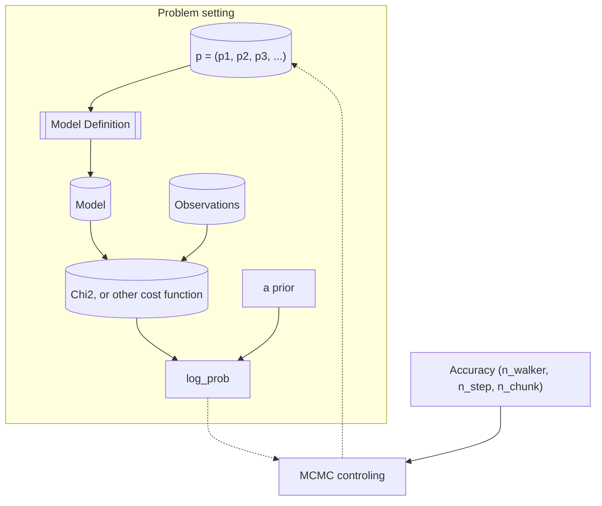

# MCMC-engine
Here I write down ideas about my MCMC model fitting engine.

In principle, the main information that the MCMC controler (e.g., emcee)
needs to know is the mapping from p to log_prob.
Once this is known, the "problem" to solve is defined,
and MCMC controler would know how to run the MCMC search (with a little additional accuracy setup).

However, in practice, in order to help the user in monitoring the MCMC process,
and in future analysis, the MCMC controler should better "know" how to dump some information about the problem.
To this end, the user should provide user-defined module that dumps the problem definition information.

In the most common case, the cost function (chi2) is computed by comparing a model (with the given p) with observation.
Therefore, the problem-dumping module should dump the information about the model setup, and the observational data.
However, not all problems are defined this way.
Some problems does not involve any moedl and data.
A problem is considered well-defined, as long as a mapping from p to log_prob is defined.
My MCMC wrapper code should provide full freedom to the user, and let the user decide how to define and describe the problem.

