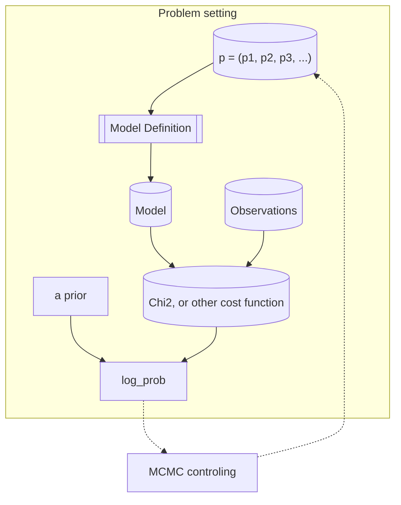

# MCMC-engine
Here I write down ideas about my MCMC model fitting engine.

In principle, the main information that the MCMC controler (e.g., emcee)
needs to know is the mapping from p to log_prob.
Once this is known, the "problem" to solve is defined,
and MCMC controler would know how to run the MCMC search (with a little additional accuracy setup).

!probability -.Find Next p.-> ParameterSet
#probability ->
#
