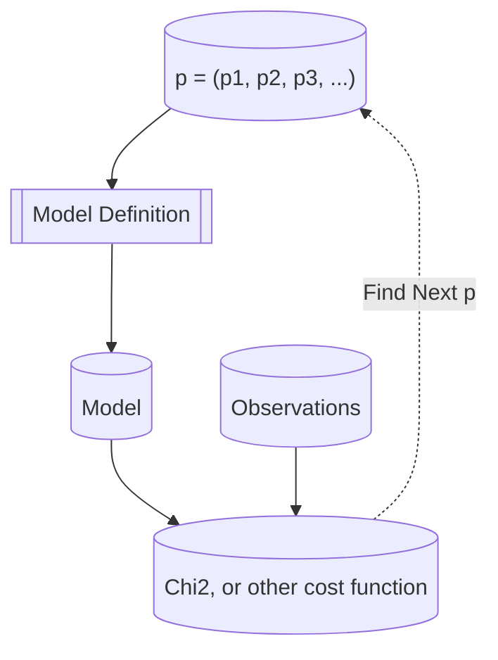

# MCMC-engine
Here I write down ideas about my MCMC model fitting engine.

```mermaid
flowchart TD
ParameterSet[("p = (p1, p2, p3, ...)")]
ModelDef[[Model Definition]]
Model[(Model)]
Obs[(Observations)]
Cost[(Chi2, or other cost function)]

ParameterSet --> ModelDef --> Model

Model & Obs--> Cost
Cost -.Find Next p.-> ParameterSet
```
